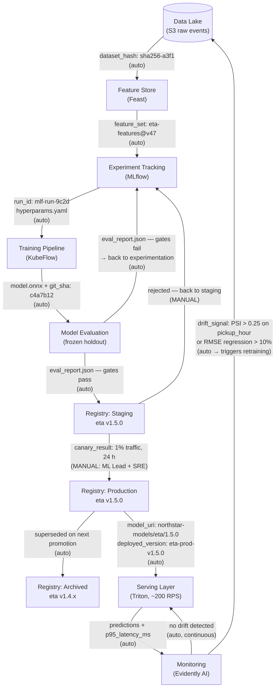

# ETA Model — MLOps Lifecycle

## Transition legend

| Arrow | Trigger | Who/What |
|-------|---------|----------|
| Data Lake → Feature Store | New raw-event batch lands | Airflow DAG (auto) |
| Feature Store → MLflow | Engineer kicks off experiment | Engineer (manual) |
| MLflow → Training Pipeline | Experiment selected for full run | Engineer (manual) |
| Training Pipeline → Evaluation | Pipeline completes | KubeFlow (auto) |
| Evaluation → Staging | All gates green (see registry spec) | CI gate (auto) |
| Evaluation → back to MLflow | Any gate fails | CI gate (auto) |
| Staging → Production | Canary passes + dual sign-off | ML Lead + SRE (manual) |
| Staging → back to MLflow | Canary rejected | ML Lead or SRE (manual) |
| Production → Serving | Deployment pipeline executes | CD pipeline (auto) |
| Production → Archived | Newer version promoted to Production | Registry hook (auto) |
| Monitoring → Data Lake | PSI > 0.25 on any key feature OR RMSE regression > 10% vs. champion | Evidently alert (auto) |
